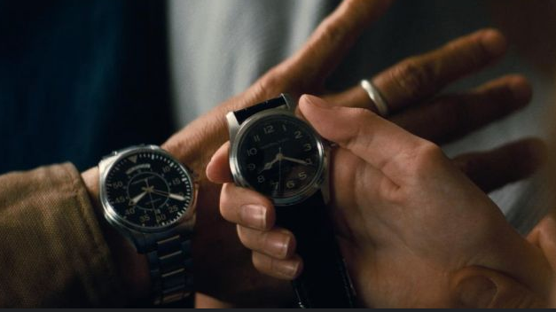
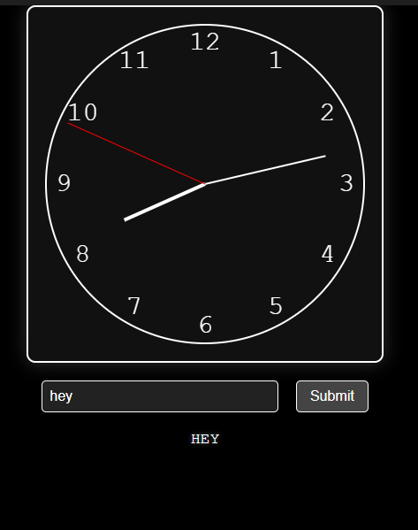

# Interstellar Morse Code Clock

 

**Inspired by *Interstellar***, this project reimagines the movie's clever use of a watch's second hand to transmit messages. In the film, binary data is communicated through subtle movements. Here, we’ve adapted that concept into an analog clock that transmits messages using Morse code!

---
 

## Project Overview

The **Interstellar Morse Code Clock** is a web app that merges a working analog clock with a Morse code transmitter. Input a message, hit "Submit," and watch the second hand animate to convey your message in dots and dashes, while the translated text appears below in real-time.

---

## How to Use
[Onilne version](https://eudk.github.io/Interstellar-Morse-Clock) 
1. **Launch the App**: Open the project in a web browser (see [Running the Project](#running-the-project)).
2. **View the Clock**: An analog clock displays the current time.
3. **Enter a Message**: Type something like "SOS" or "HELLO" (A-Z, 0-9 supported).
4. **Transmit**: Click "Submit."
5. **Observe**: The second hand moves to signal:
   - **Dot**: Swings to 15° briefly.
   - **Dash**: Swings to 45° for longer.
6. **Live Output**: Below the clock:
   - **Morse Code**: Current sequence (e.g., "....").
   - **Translation**: Builds letter by letter (e.g., "H" → "HI").
7. **Completion**: Clock resumes normal timekeeping; message stays displayed.

**Example**:
- Input: "SOS"
- Morse: "... --- ..."
- Output: "S" → "SO" → "SOS"

---

## Technical Details

Built using:
- **HTML5**: For structure and `<canvas>` clock rendering.
- **CSS**: For a polished look.
- **JavaScript**: Drives clock updates, Morse conversion, and animations.

---

## Running the Project

1. **Get the Files**: Clone or download the repository.
2. **Open `index.html`**: Use a modern browser (e.g., Chrome).
3. **Start Interacting**: Clock runs automatically; input messages to transmit.

**No server required**—just a browser with HTML5 support.

---

## Morse Code Implementation

- **Supported Characters**:
  - A-Z (e.g., "A" → ".-", "Z" → "--..").
  - 0-9 (e.g., "1" → ".----", "5" → ".....").
  - Space between words → "/".
- **Timing**:
  - Dot: 0.3s.
  - Dash: 0.9s.
  - Gaps: 0.3s between elements, 0.9s between letters, 2.1s between words.
- **Animation**:
  - Dot: 15° swing.
  - Dash: 45° swing.
  - Rest: 0°.

---

## Inspiration

This project draws its concept from *Interstellar*, where a watch’s second hand encodes critical messages. We’ve transformed that idea into a Morse code-based system, blending creativity with interactivity.

---

## Future Enhancements

- Add sound effects for dots and dashes.
- Allow adjustable transmission speeds.
- Support punctuation marks.
- Log past messages.

---
---

## Credits
- Built with Grok 3 (xAI) 
- [eudk](https://github.com/eudk)   
- Feel free to submit pull requests and improve it!

---
Have fun with the Interstellar Morse Code Clock! Contributions and feedback are welcome.
